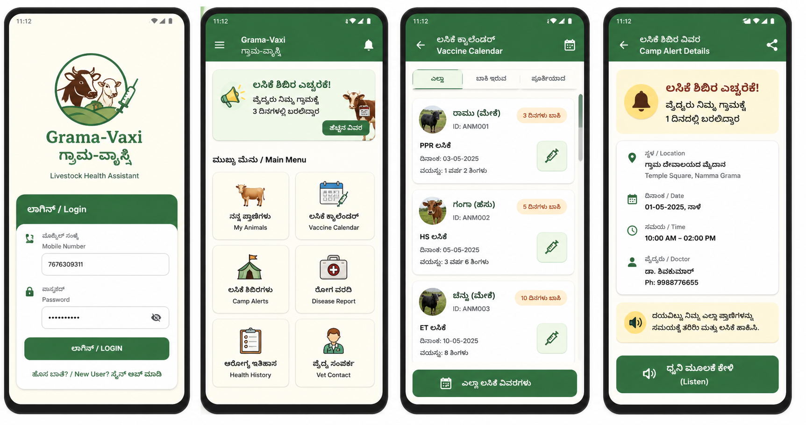

# GRAMA-VAXI | ಗ್ರಾಮ-ವ್ಯಾಕ್ಸಿ

Livestock Health Alert Android App for Rural Farmers

## About the Project

Grama-Vaxi is a bilingual (Kannada + English) Android application designed for rural farmers in Karnataka.  
The app helps farmers manage livestock vaccination schedules, receive camp alerts, and maintain digital health records for animals.

It focuses on preventing livestock loss caused by missed vaccination camps and lack of proper health tracking.

---

## Features

- Animal Registration (Cow, Goat, Sheep, Buffalo)
- Digital Vaccination Records
- Vaccination Schedule Tracking
- Government Camp Alerts
- Disease Reporting System
- Offline Support using Room Database
- Kannada + English UI
- Background Notifications with WorkManager

---

## Tech Stack

- **Language:** Kotlin
- **Architecture:** MVVM
- **Database:** Room (SQLite)
- **UI:** XML + Material Design 3
- **Background Tasks:** WorkManager
- **Image Loading:** Coil

---

## Screenshots

_Add screenshots inside `/screenshots` folder._

```md

